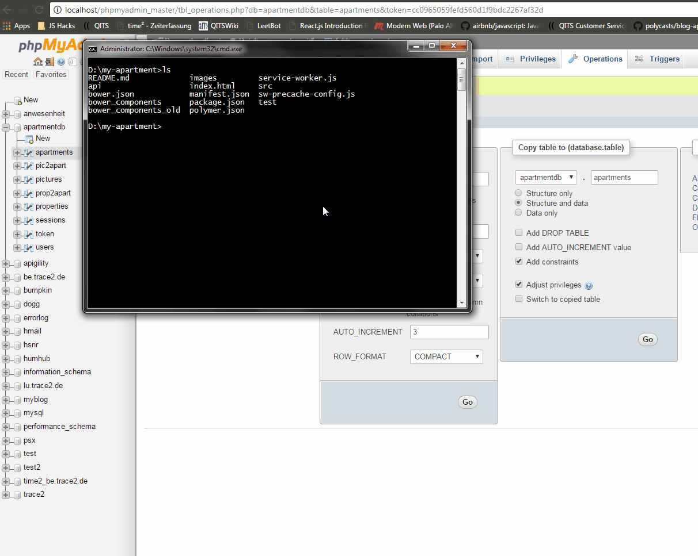
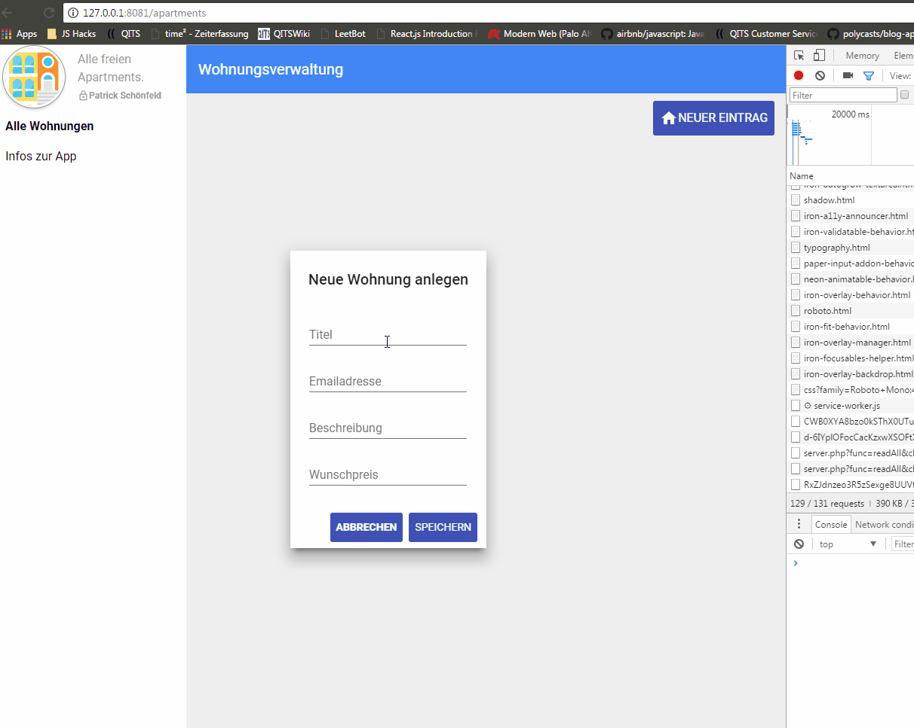
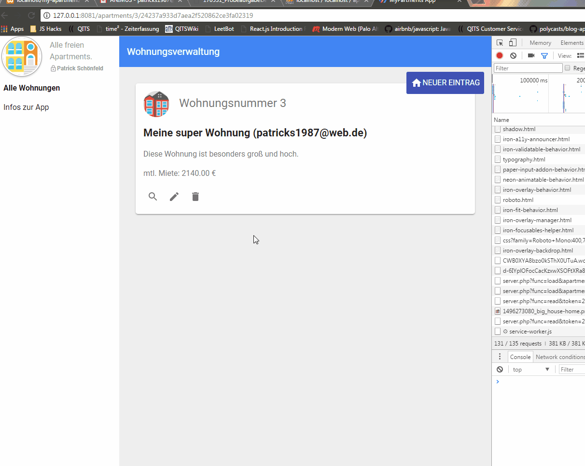
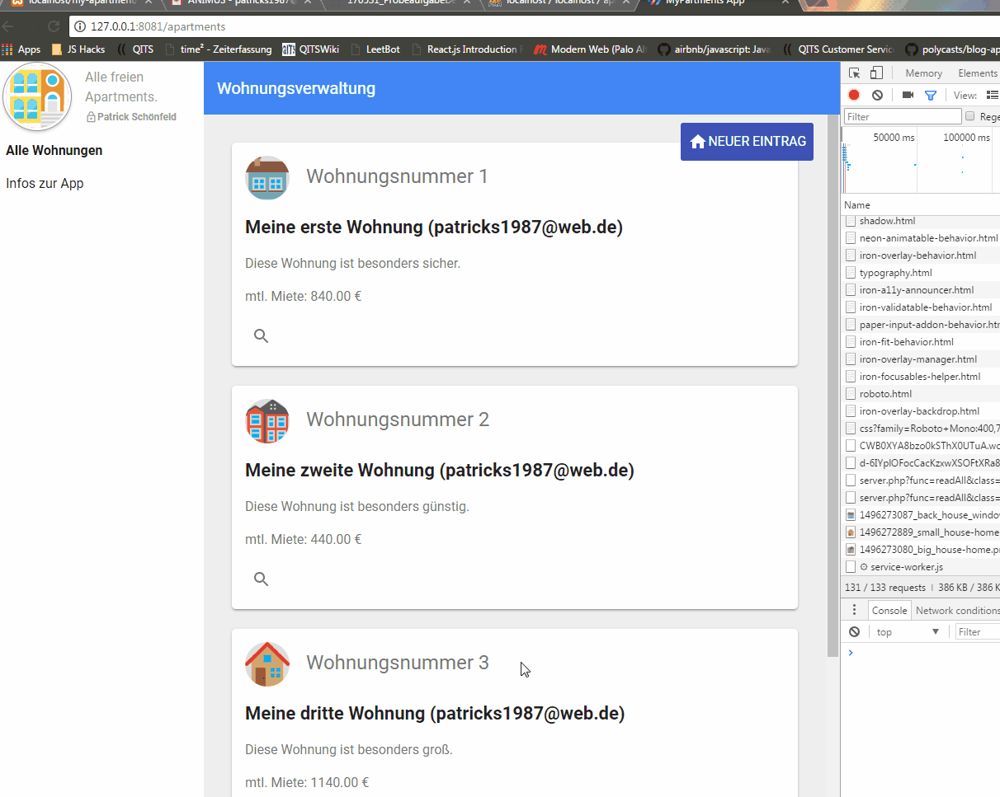
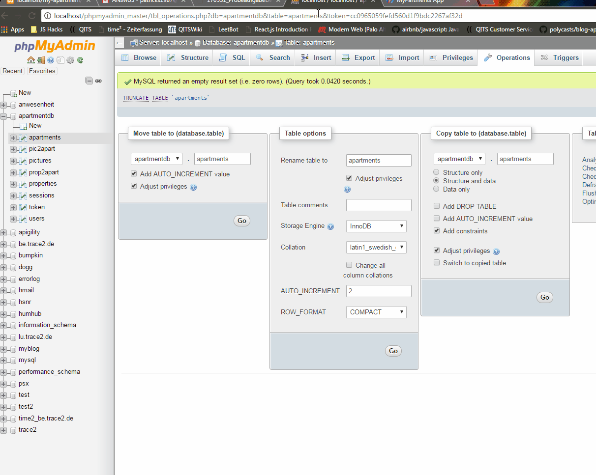

##Apartment PWA (+ PHP Implementation)

### Setup (Frontend)

##### Prerequisites
 * Install polymer-cli `npm install -g polymer-cli`
 * Install bower `npm install -g bower`
 * Locate bower.json and install dependencies with `bower install`

### Setup (Server)
 * Install PHP (Tested with PHP Version 7.1.1)
 * Ensure /api is getting parsed by PHP processor
 * Install MySQL DB (Port: 3306)
 * Create DB, Load in Dump dump/db.sql
 
### Configure App
 * Insert DB Credentials /api/db.inc.php
 * In src/main.js replace 'http://localhost/my-apartment/api/server.php' with your URL to server.php

### Start
 * Locate polymer.json and serve content `polymer serve`
 
### Activate mailing
 * ensure PHP mail() is working on installed PHP machine
 * locate class.apartments.php and comment in line 39
 
 
## Documentation

